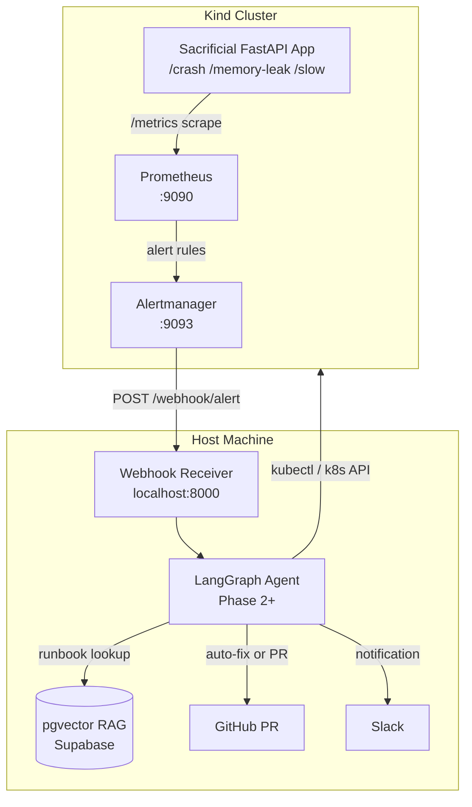

# KubeSentinel

> Autonomous AI SRE platform that detects, diagnoses, and remediates Kubernetes failures using LangGraph.

KubeSentinel watches a Kubernetes cluster via Prometheus + Alertmanager. When an alert fires, a LangGraph agent investigates using live cluster data, retrieves historical runbooks from a pgvector RAG store, and either auto-remediates or opens a GitHub Pull Request with a Root Cause Analysis and proposed fix.

---

## Architecture Overview



**Phase 1** (this branch) delivers everything up to and including the Webhook Receiver.  
**Phase 2** adds the LangGraph agent core with tool definitions.  
**Phase 3** wires the agent to the webhook receiver and implements auto-remediation.

---

## Tech Stack

| Layer | Technology |
|-------|-----------|
| Language | Python 3.12 |
| Package manager | uv |
| Agent framework | LangGraph + LangChain |
| LLM provider | OpenRouter (primary), Gemini (long-context) |
| Backend | FastAPI + uvicorn |
| Cluster | Kind (Kubernetes in Docker) |
| Monitoring | Prometheus + Alertmanager (kube-prometheus-stack Helm chart) |
| Vector DB | Supabase + pgvector |
| K8s client | `kubernetes` Python SDK |

---

## Phase 1 Quick-Start

### Prerequisites

- Docker Desktop (Windows) with WSL2 backend
- [Kind v0.31+](https://kind.sigs.k8s.io/docs/user/quick-start/#installation)
- [kubectl](https://kubernetes.io/docs/tasks/tools/)
- [Helm v3](https://helm.sh/docs/intro/install/)
- [uv](https://docs.astral.sh/uv/)
- Python 3.12 (`py -3.12 --version` should work)

### 1. Bring up the full stack

**Windows (PowerShell):**
```powershell
.\make.ps1 up
```

**Linux/macOS:**
```bash
make up
```

This will:
1. Create a Kind cluster named `kubesentinel` using `kindest/node:v1.33.0`
2. Build the sacrificial app Docker image (`kubesentinel/sacrificial:0.1.0`)
3. Load the image into Kind (no registry needed)
4. Install `kube-prometheus-stack` via Helm into the `monitoring` namespace
5. Apply all Kubernetes manifests into the `kubesentinel` namespace

> **Note:** The Helm install step (`--wait`) can take 5–8 minutes on first run.

### 2. Verify everything is running

```bash
kubectl get pods -A
```

Expected output includes pods in `Running` state for:
- `monitoring/kube-prometheus-stack-prometheus-*`
- `monitoring/kube-prometheus-stack-alertmanager-*`
- `kubesentinel/sacrificial-*` (two replicas)

Open the Prometheus UI: http://localhost:9090  
Open the Alertmanager UI: http://localhost:9093

### 3. Start the webhook receiver

```powershell
# Windows
.\make.ps1 webhook-dev

# Linux/macOS
make webhook-dev
```

This starts the FastAPI webhook receiver on `http://localhost:8000`. It will receive Alertmanager notifications.

> **Windows / host.docker.internal:** Alertmanager is configured to POST to `http://host.docker.internal:8000/webhook/alert`. On Windows with Docker Desktop, `host.docker.internal` resolves automatically. If it does not, find your LAN IP with `ipconfig` and update the `url` in `infra/helm/values.yaml`, then run `.\make.ps1 helm-install` again.

### 4. Trigger test alerts

```powershell
# Windows
.\make.ps1 break-app

# Linux/macOS
make break-app
```

This hits `/crash` (20×), `/slow` (3×), and `/memory-leak` (15×) on the sacrificial app in sequence. Within 1–2 minutes you should see `HighErrorRate`, `HighLatency`, and `HighMemoryUsage` alerts firing in Prometheus and arriving at your webhook receiver logs.

Access the sacrificial app directly:
```bash
kubectl port-forward -n kubesentinel svc/sacrificial 8080:80
curl http://localhost:8080/
curl http://localhost:8080/crash       # → 500
curl http://localhost:8080/memory-leak # → allocates 10 MiB
curl "http://localhost:8080/slow?duration=3"
```

### 5. Tear down

```powershell
.\make.ps1 down   # Windows
make down         # Linux/macOS
```

---

## Project Structure

```
KubeSentinel/
├── agent/
│   └── webhook.py          # Phase 1: stub Alertmanager webhook receiver
├── app/sacrificial/        # Deliberately broken FastAPI app
│   ├── main.py
│   ├── Dockerfile
│   ├── pyproject.toml
│   ├── requirements.txt
│   └── README.md
├── infra/
│   ├── kind/cluster.yaml   # Kind cluster config
│   ├── k8s/                # Kubernetes manifests
│   └── helm/values.yaml    # kube-prometheus-stack overrides
├── docs/
│   └── architecture.md     # Detailed architecture doc
├── tests/                  # pytest suite
├── Makefile                # Linux/macOS automation
├── make.ps1                # Windows PowerShell automation
├── pyproject.toml          # Root Python project (agent package)
└── requirements.txt        # Compiled by uv
```

---

## Alerts Defined

| Alert | Condition | Severity |
|-------|-----------|----------|
| `HighErrorRate` | 5xx rate > 10% over 1 min | warning |
| `PodCrashLooping` | Pod restarts > 3 in 5 min | critical |
| `HighMemoryUsage` | Memory > 90% of 128Mi limit | warning |
| `HighLatency` | p95 latency > 1s over 5 min | warning |

---

## Development

```powershell
# Create venv and install all dependencies (Windows)
py -3.12 -m venv .venv
.venv\Scripts\pip install -r requirements.txt

# Lint
.venv\Scripts\ruff check .

# Tests
.venv\Scripts\pytest
```
