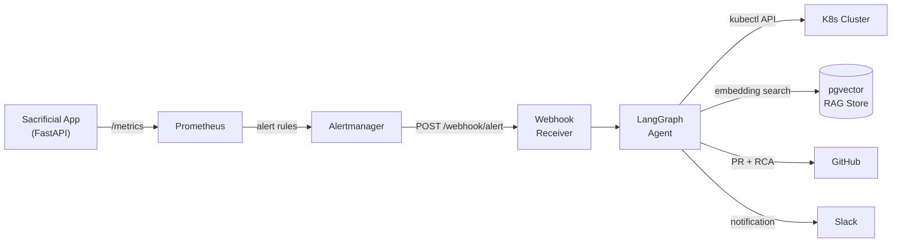

# KubeSentinel

> Autonomous AI-powered SRE that detects Kubernetes failures, investigates using a LangGraph agent with RAG memory, and opens remediation PRs — in under 90 seconds.

[](https://github.com/vivekanjana76/kubesentinel/actions/workflows/ci.yml)

<!-- Demo GIF — replace after recording (see docs/demo-recording-guide.md) -->


---

## What It Does

KubeSentinel monitors a Kubernetes cluster through Prometheus and Alertmanager. When a pod crashes, OOMs, or breaches latency thresholds, a LangGraph agent autonomously investigates using live cluster data, retrieves relevant runbooks from a pgvector RAG store, diagnoses the root cause with an LLM, and either applies a fix or opens a GitHub PR with a structured Root Cause Analysis — then notifies your team on Slack.

---

## Architecture



See [docs/architecture.md](docs/architecture.md) for detailed component diagrams and a full alert-to-PR sequence diagram.

---

## Tech Stack

| Layer | Technology | Role |
|---|---|---|
| Orchestration | LangGraph + LangChain | Stateful 8-node reasoning loop with conditional routing |
| LLM | OpenRouter (Llama 3.3 70B) | Diagnosis, structured output, fix generation |
| Embeddings | sentence-transformers / BGE-small | Local 384-dim embeddings, zero API cost |
| Vector DB | Supabase + pgvector | Runbook RAG store with HNSW cosine index |
| Backend | FastAPI + uvicorn | Webhook receiver + agent trigger |
| Cluster | Kind (K8s in Docker) | Local development cluster with NodePort access |
| Monitoring | Prometheus + Alertmanager | Metrics scraping, alert rules, webhook dispatch |
| K8s Client | `kubernetes` Python SDK | Pod logs, events, deployment patches |
| GitHub | PyGithub | Branch creation, file commits, PR with RCA |
| Slack | slack-sdk | Incident notifications, emoji-reaction approval gate |

---

## Quick Start

```powershell
git clone https://github.com/vivekanjana76/kubesentinel.git
cd kubesentinel
py -3.12 -m venv .venv; .venv\Scripts\Activate.ps1
pip install -r requirements.txt
# Configure .env from .env.example, then:
py -3.12 -m agent.cli demo --scenario OOMKilled
```

> The `demo` command uses MockToolkit — no cluster, credentials, or external services needed. See [docs/demo-flow.md](docs/demo-flow.md) for a full live-demo guide with real K8s + GitHub + Slack.

---

## Measured Performance

| Metric | Value | Notes |
|---|---|---|
| MTTR (median) | 236.6s | MockToolkit + Llama 3.3 70B via OpenRouter |
| MTTR (min / max) | 204.1s / 239.7s | 5 runs, measured with `Measure-Command` |
| Reasoning node | ~55s per call (~80% of MTTR) | Free-tier LLM latency dominates |
| Test suite | 133 tests, all passing | Fully mocked — no credentials needed in CI |
| Test coverage | 64% overall, 93% core logic | `agent/` package, measured with pytest-cov |
| RAG retrieval quality | 0.69 - 0.82 cosine similarity | Across 8 canonical runbook queries |
| LangGraph nodes | 8 | receive_alert, investigate, search_history, reason, prepare_retry, remediate, escalate, report |
| Conditional routes | 3 | remediate (conf >= 0.7), prepare_retry (conf < 0.4 + retries), escalate (fallback) |

> **Why ~4 minutes?** The `reason` node makes 1–3 LLM calls to OpenRouter's **free tier**, where upstream providers throttle requests aggressively (~55s per call). With a paid API key or self-hosted model, MTTR drops to single-digit seconds — the agent's own logic (tool calls, RAG retrieval, graph traversal) completes in under 5 seconds. See [docs/metrics.md](docs/metrics.md) for full methodology, per-node breakdown, and raw data.

---

## How It Works

**Alert Pipeline.** A deliberately broken FastAPI app runs inside a Kind cluster. Prometheus scrapes its `/metrics` endpoint every 15 seconds and evaluates four alert rules (HighErrorRate, PodCrashLooping, HighMemoryUsage, HighLatency). When a rule fires, Alertmanager groups the alert and POSTs it to a webhook receiver on the host machine, which validates the payload and triggers the agent.

**LangGraph State Machine.** The agent is an eight-node state graph. It receives the alert, investigates by pulling pod logs, events, and recent commits, then searches the RAG store for matching runbooks. The `reason` node calls an LLM with structured output to produce a diagnosis, proposed fix, and confidence score. A conditional router sends high-confidence fixes to `remediate` (which applies a kubectl patch or opens a GitHub PR), low-confidence results back to `investigate` for a re-try loop, and everything else to `escalate`. Every run ends with a markdown RCA report.

**RAG Memory.** Eight seed runbooks covering common Kubernetes failure modes are chunked, embedded locally using BGE-small-en-v1.5 (384 dimensions, zero API cost), and stored in Supabase with a pgvector HNSW cosine index. The retriever returns the top-k matches by cosine similarity, giving the LLM grounded context for diagnosis. See [docs/rag-architecture.md](docs/rag-architecture.md) for schema design and chunking strategy.

---

## Project Structure

```
KubeSentinel/
├── agent/                  # LangGraph agent core
│   ├── cli.py              # CLI: demo, live, verify-tools, demo-reset
│   ├── graph.py            # State machine wiring + DI factory
│   ├── settings.py         # Pydantic-settings (all config from .env)
│   ├── state.py            # AgentState, ProposedFix, ActionLog, AlertPayload
│   ├── nodes/              # 7 node implementations + routing logic
│   ├── llm/factory.py      # OpenRouter/Gemini + structured-output fallback
│   ├── tools/              # MockToolkit, RealToolkit, safety guards, Slack approval
│   └── rag/                # RAG pipeline: migrate, ingest, retriever
├── app/sacrificial/        # Intentionally broken FastAPI app (the workload)
├── infra/                  # Kind cluster config, K8s manifests, Helm values
├── docs/                   # Architecture, runbooks, safety, demo guide, metrics
├── tests/                  # 133 tests: RAG, agent, tools, CLI (all mocked)
├── .github/workflows/      # CI: ruff lint + pytest on every push/PR
├── pyproject.toml          # Python project config
└── requirements.txt        # Locked dependencies
```

---

## Build History

| Phase | What It Added | PR |
|---|---|---|
| **1. Infrastructure** | Kind cluster, sacrificial FastAPI app, Prometheus/Alertmanager stack, webhook receiver, Makefile automation | [#2](https://github.com/vivekanjana76/kubesentinel/pull/2) |
| **2. RAG Memory** | 8 seed runbooks, Supabase pgvector schema, local BGE embeddings, runbook retriever, 23 tests | [#4](https://github.com/vivekanjana76/kubesentinel/pull/4) |
| **3. Agent Skeleton** | LangGraph 8-node state machine, MockToolkit, OpenRouter reasoning, structured output with fallback, CLI, 44 tests | [#6](https://github.com/vivekanjana76/kubesentinel/pull/6) |
| **4. Real Tools** | RealToolkit (K8s API, GitHub PRs, Slack notifications), 6 safety guards, dry-run mode, Slack emoji approval gate, webhook autotrigger, 122 tests | [#8](https://github.com/vivekanjana76/kubesentinel/pull/8) |
| **5. Polish** | README rewrite, CI pipeline, measured metrics, architecture diagrams, demo recording guide, resume content | [#10](https://github.com/vivekanjana76/kubesentinel/pull/10) |

> Test counts shown cumulative.

---

## Deeper Docs

- [docs/architecture.md](docs/architecture.md) — Component diagram, alert lifecycle sequence diagram, namespace layout, design decisions
- [docs/agent-architecture.md](docs/agent-architecture.md) — State model, node graph, DI seam (mock vs real), reasoning prompt, re-investigation loop, OOMKilled sequence diagram
- [docs/rag-architecture.md](docs/rag-architecture.md) — Schema design, embedding model rationale, chunking strategy, retrieval sequence diagram
- [docs/safety-boundaries.md](docs/safety-boundaries.md) — Six safety guards, dry-run behavior, production equivalents
- [docs/demo-flow.md](docs/demo-flow.md) — Step-by-step live demo script, Slack app setup, troubleshooting
- [docs/metrics.md](docs/metrics.md) — MTTR measurements, test coverage, retrieval quality, methodology

---

## Safety and Production Notes

- **Dry-run by default.** All destructive operations (kubectl patches, GitHub PRs, Slack messages) are no-ops unless `DRY_RUN=false` is explicitly set. Six non-bypassable safety guards protect every write path.
- **Namespace allowlist.** The agent can only operate within configured namespaces (`ALLOWED_NAMESPACES`). Attempts to patch resources in other namespaces are rejected before reaching the K8s API.
- **Slack approval gate.** kubectl patch remediations require emoji-reaction approval in Slack before executing, providing a human-in-the-loop checkpoint.
- **Production readiness path.** A production deployment would replace kubeconfig with a ServiceAccount + RBAC, swap the GitHub PAT for a GitHub App installation token, use Slack interactivity webhooks instead of reaction polling, and run the agent as a Kubernetes Deployment with health checks.

---

## License

[MIT](LICENSE)
