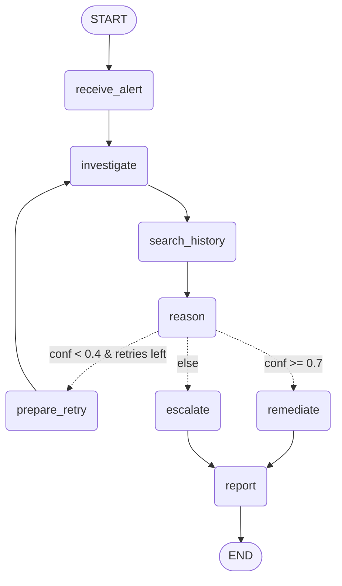
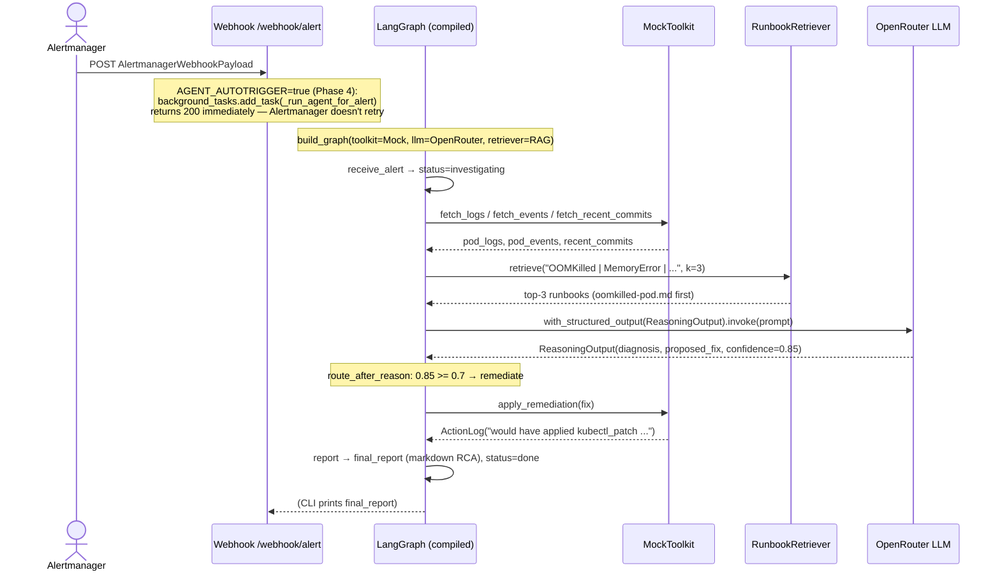

# Agent Architecture

The KubeSentinel agent is a LangGraph state machine that turns an Alertmanager
webhook into either an applied remediation, an escalation, or a request for
human review — always ending with a markdown RCA report.

This document covers:

1. The state model
2. The node graph and conditional routing
3. The dependency-injection seam (mock vs real)
4. The reasoning prompt + structured output
5. The re-investigation loop
6. Observability
7. A sequence diagram of an end-to-end OOMKilled run

---

## 1. State model

State is a Pydantic v2 `BaseModel` (`agent/state.py:AgentState`). LangGraph
accepts the model class as the graph schema and merges partial dict updates
returned by each node.

| Field | Purpose |
|---|---|
| `alert: AlertPayload` | The incoming, normalized alert (independent of Alertmanager schema). |
| `pod_logs`, `pod_events`, `recent_commits` | Investigation findings from the toolkit. |
| `retrieved_runbooks: list[Runbook]` | Top-k matches from the Phase 2 RAG. |
| `diagnosis`, `proposed_fix`, `confidence` | Structured LLM output. |
| `actions_taken: list[ActionLog]` | Audit trail — one entry per tool/LLM call. |
| `final_report: str \| None` | Markdown RCA emitted by the `report` node. |
| `iteration`, `max_iterations` | Re-investigation loop control. |
| `status: AgentStatus` | One of `investigating`, `remediating`, `reporting`, `done`, `failed`. |

Two helper models live alongside:

- `ProposedFix`: typed `kubectl_patch | code_change | config_update` plus
  target, description, and exact command-or-diff.
- `ActionLog`: timestamped audit entry — node, action verb, result, metadata.
- `ReasoningOutput`: the schema the LLM is forced to return via
  `with_structured_output(ReasoningOutput)`.

---

## 2. Node graph



(Auto-generated equivalent available via `graph.get_graph().draw_mermaid()`.)

**Node responsibilities:**

| Node | Reads | Writes |
|---|---|---|
| `receive_alert` | `state.alert` | `actions_taken`, `status` |
| `investigate` | `state.alert`, toolkit | `pod_logs`, `pod_events`, `recent_commits`, `actions_taken` |
| `search_history` | findings, retriever | `retrieved_runbooks`, `actions_taken` |
| `reason` | full state, LLM | `diagnosis`, `proposed_fix`, `confidence`, `actions_taken` |
| `prepare_retry` | `iteration`, `confidence` | bumps `iteration`, resets reasoning output, `actions_taken` |
| `remediate` | `proposed_fix`, toolkit | `actions_taken`, `status` |
| `escalate` | `confidence`, `proposed_fix` | `actions_taken`, `status` |
| `report` | full state | `final_report`, `status` |

Each node is a pure function `(state) -> dict[str, Any]`. Side-effecting
collaborators (toolkit, LLM, retriever) are bound via `functools.partial` in
`agent/graph.py:build_graph()`.

---

## 3. Real vs Mock Tools

The graph code never imports a concrete toolkit. `build_graph()` accepts a
`Toolkit` ABC instance; all nodes interact only with the abstract interface.
Swapping real for mock is one line in the calling code — the graph is untouched.

```python
# Mock (Phase 3 / CI / demo without credentials)
build_graph(toolkit=MockToolkit("OOMKilled"), llm=get_reasoning_llm(), retriever=get_retriever())

# Real (Phase 4 / live demo)
build_graph(toolkit=RealToolkit(...), llm=get_reasoning_llm(), retriever=get_retriever())
```

`get_default_toolkit()` (in `agent/graph.py`) encapsulates this decision:

```python
def get_default_toolkit(alert_name: str = "unknown") -> Toolkit:
    if settings.agent_use_real_tools:
        return build_real_toolkit(settings, alert_name=alert_name)
    return MockToolkit(scenario="OOMKilled")
```

Set `AGENT_USE_REAL_TOOLS=true` in `.env` to activate the real toolkit. Run
`python -m agent.cli verify-tools` first to confirm all credentials work.

### MockToolkit

Reads from `agent/tools/fixtures/scenarios.yaml`. Ships four scenarios matching
the Phase 2 seed runbooks: `OOMKilled`, `HighErrorRate`, `ImagePullBackOff`,
`HighLatency`. Write methods (`apply_remediation`, `open_pr`, `post_slack`) are
no-ops that return descriptive `ActionLog` entries. No external credentials needed.

### RealToolkit

Backed by three live clients:

| Client | Auth | Read ops | Write ops |
|---|---|---|---|
| Kubernetes | `~/.kube/config` (or `KUBECONFIG_PATH`) | `fetch_logs`, `fetch_events` | `apply_remediation` (kubectl_patch via AppsV1Api) |
| GitHub | `GITHUB_TOKEN` PAT | `fetch_recent_commits` | `open_pr` (branch + 2-file commit + PR) |
| Slack | `SLACK_BOT_TOKEN` xoxb- | — | `post_slack`, Slack approval gate |

All write operations are guarded by six safety checks (see
[docs/safety-boundaries.md](safety-boundaries.md)) and are no-ops when
`DRY_RUN=true` (the default).

### Slack approval gate

When `REQUIRE_SLACK_APPROVAL_FOR_PATCHES=true` (default) and a `kubectl_patch`
fix is proposed in live mode, the agent:

1. Posts a Block Kit message to `#incidents` with the fix details and RCA.
2. Polls `reactions.get` every 5 seconds for up to 5 minutes.
3. Returns `approved` on ✅ (`:white_check_mark:`), `rejected` on ❌ (`:x:`).
4. Raises `ApprovalDeniedError` on rejection or timeout; the run escalates.

This design avoids requiring a publicly reachable callback URL (which
interactive Slack buttons need). See [docs/demo-flow.md](demo-flow.md) for the
full demo script including Slack scope requirements.

---

## 4. Reasoning + structured output

The `reason` node formats a prompt containing the alert, findings, recent
commits, and top-k runbooks, then calls:

```python
structured = get_structured_llm(llm, ReasoningOutput)
output: ReasoningOutput = structured.invoke(prompt)
```

`get_structured_llm()` (in `agent/llm/factory.py`) wraps
`llm.with_structured_output(schema)` with an automatic fallback:

1. Try the default — function calling (what `langchain-openai` uses by default).
2. If the model raises `NotImplementedError` or an error that mentions
   "function calling not supported", retry with `method="json_mode"`.
3. Pydantic validation on the returned object catches malformed JSON.

A structured warning (`llm.structured_output.fallback`) is emitted when the
fallback fires, so the behavior is visible in logs and LangSmith traces.

**Why this matters:** OpenRouter free-tier models have inconsistent
function-calling support. Llama 3.3 70B handles tool calling reliably; some
DeepSeek variants do not. The fallback keeps `reason` working across model
swaps without touching node code.

---

## 5. Re-investigation loop

When `confidence < confidence_low` (default 0.4) *and* there are retries left
(`iteration < max_iterations - 1`), `route_after_reason` returns
`"prepare_retry"`. The `prepare_retry` node:

1. Bumps `iteration` by one.
2. Resets `confidence`, `diagnosis`, `proposed_fix` to defaults.
3. Appends a `loop_back` `ActionLog`.

The flow then re-enters `investigate`. With a real toolkit, the second pass
may surface newer/more detailed cluster state. With the mock, the
`force_low_confidence_first_pass=True` flag is the test hook — it returns
only a slice of the fixture data on the first call.

Loop termination is guaranteed by `iteration < max_iterations - 1`: at
`iteration == max_iterations - 1` the conditional falls through to
`escalate`, regardless of confidence.

---

## 6. Observability

- **structlog**: every node emits `node.entry` and `node.exit` with
  `duration_ms` and `fields_updated`. Implemented in
  `agent/nodes/_logging.py:node_span`.
- **Audit trail**: every tool call and LLM call appends an `ActionLog`. The
  `report` node renders the full trail into the final RCA.
- **LangSmith** (opt-in): set `LANGCHAIN_TRACING_V2=true` and
  `LANGCHAIN_API_KEY` in `.env`. LangChain auto-routes traces — no code
  changes needed.

---

## 7. Sequence diagram — OOMKilled end-to-end



---

## Adding a new scenario

1. Append a new entry to `agent/tools/fixtures/scenarios.yaml` keyed by alert name.
2. Append a `Runbook` to `docs/runbooks/` and re-run `agent.rag.ingest` so the
   RAG can return it.
3. Add the alert to `SCENARIOS` and `DEFAULT_ALERTS` in `agent/cli.py`.
4. Optionally add a `tests/agent/test_graph_<scenario>.py` assertion.
