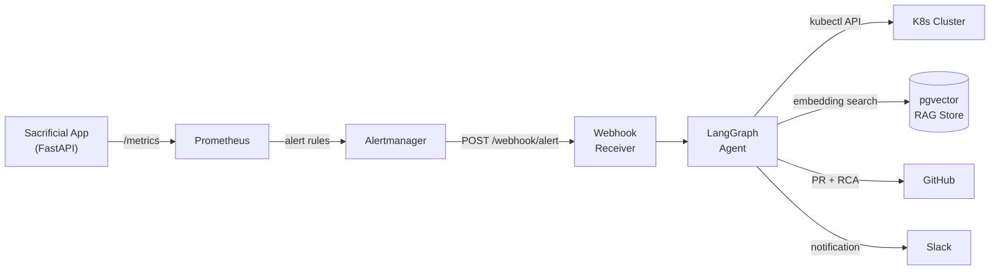
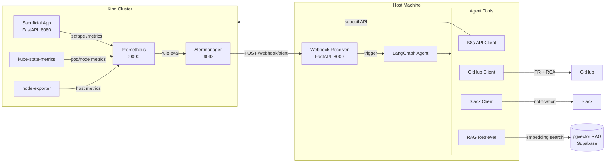
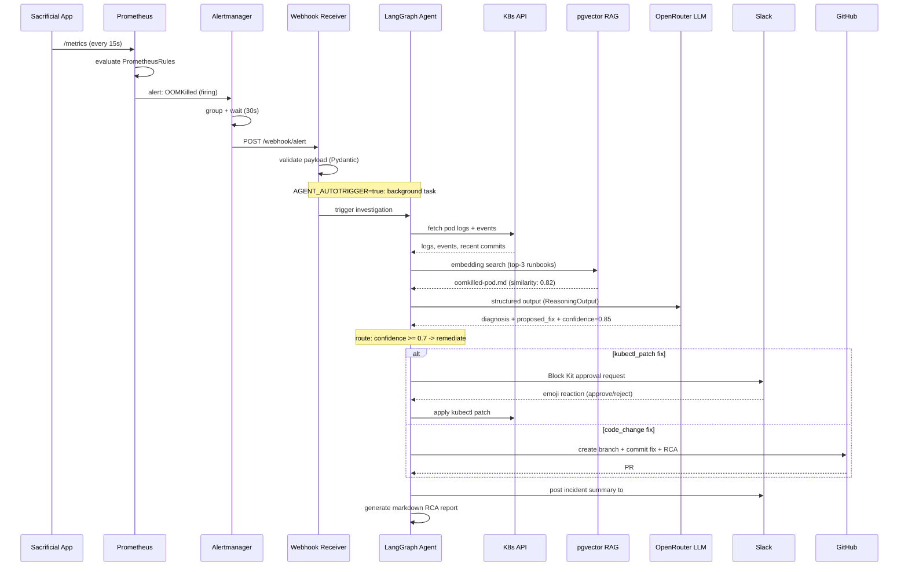

# KubeSentinel — Architecture

## System Overview

KubeSentinel is an autonomous SRE platform built around a LangGraph agent loop. The platform observes a Kubernetes cluster, detects failures through Prometheus alerting, investigates them with AI-assisted tool calls, and either remediates automatically or produces a structured incident report as a GitHub Pull Request.

---

## Top-Level Flow

---

## Detailed Component Diagram

---

## Data Flow — Full Alert-to-PR Lifecycle

---

## Namespace Layout

| Namespace | Contents |
|-----------|----------|
| `kubesentinel` | Sacrificial app (Deployment, Service, ServiceMonitor, PrometheusRule) |
| `monitoring` | kube-prometheus-stack (Prometheus, Alertmanager, Grafana, kube-state-metrics, node-exporter) |

---

## Phase Roadmap

### Phase 1 — Infrastructure Foundation (complete)
- Kind cluster with NodePort mappings for Prometheus/Alertmanager UIs
- Sacrificial FastAPI app with deliberate failure endpoints
- Kubernetes manifests: Deployment, Service, ServiceMonitor, PrometheusRule
- kube-prometheus-stack via Helm (laptop-tuned resource limits)
- Stub webhook receiver (validates payload, logs, returns 200)
- Makefile + PowerShell automation

### Phase 2 — RAG Memory (complete)
- 8 seed runbooks covering common K8s failure modes
- Supabase pgvector store with HNSW cosine index
- Local BGE-small-en-v1.5 embeddings (384 dims, zero API cost)
- Runbook retriever with top-k cosine similarity search
- 23 tests (chunker, retriever, ingest — all mocked)

### Phase 3 — Agent Skeleton (complete)
- LangGraph 8-node state machine with conditional routing
- MockToolkit for offline demos (4 scenarios from YAML fixtures)
- OpenRouter reasoning with structured output + JSON fallback
- CLI: demo, --all summary table
- 44 tests (21 agent + 23 RAG)

### Phase 4 — Real Tools (complete)
- RealToolkit: live K8s API, GitHub PR creation, Slack notifications
- 6 non-bypassable safety guards (namespace, resource kind, PR target, Slack channel, shell injection, dry-run)
- Slack emoji-reaction approval gate for kubectl patches
- Webhook autotrigger (FastAPI BackgroundTasks)
- CLI: live, verify-tools, demo-reset
- 122 tests (all external calls mocked)

### Phase 5 — Polish (complete)
- README rewrite for recruiter-ready presentation
- GitHub Actions CI pipeline (ruff + pytest)
- Measured performance metrics with methodology
- Architecture diagram polish, demo recording guide
- Resume content, PROJECT_HANDOFF.md

---

## Key Design Decisions

### Why Kind over Minikube?
Kind runs Kubernetes nodes as Docker containers, which integrates cleanly with Docker Desktop on Windows without requiring Hyper-V. Port mappings are defined declaratively in the cluster config YAML.

### Why a "sacrificial" app?
Having a real workload that can be deliberately broken gives Prometheus realistic metrics to scrape. This is more representative than mock data and exercises the full alert pipeline from metric → rule evaluation → Alertmanager → webhook.

### Why `host.docker.internal` for the webhook URL?
The Alertmanager runs inside the cluster; the webhook receiver runs on the host. `host.docker.internal` is Docker Desktop's DNS name for the host machine, reachable from within any container on Windows and macOS. On Linux, a static IP or `--add-host` is needed instead.

### Why 128Mi memory limit on the sacrificial app?
A realistic OOMKilled scenario requires the container's memory limit to be reachable. 128Mi is low enough that 12–15 calls to `/memory-leak` (each allocating 10 MiB) will exhaust it and trigger a container restart, exercising the `PodCrashLooping` and `HighMemoryUsage` alert rules.

### Why structlog for the webhook receiver?
structlog produces structured JSON-friendly log lines with consistent key-value pairs. This makes it straightforward to later pipe webhook logs into an observability stack or parse them in tests.
