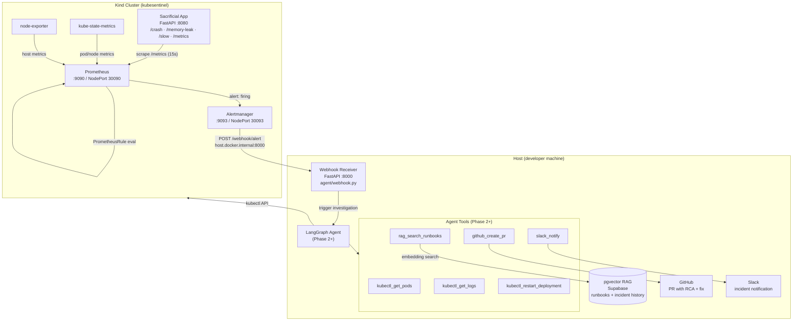
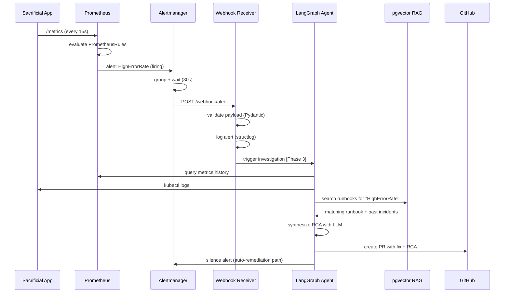

# KubeSentinel — Architecture

## System Overview

KubeSentinel is an autonomous SRE platform built around a LangGraph agent loop. The platform observes a Kubernetes cluster, detects failures through Prometheus alerting, investigates them with AI-assisted tool calls, and either remediates automatically or produces a structured incident report as a GitHub Pull Request.

---

## Component Diagram

---

## Data Flow — Alert Lifecycle

---

## Namespace Layout

| Namespace | Contents |
|-----------|----------|
| `kubesentinel` | Sacrificial app (Deployment, Service, ServiceMonitor, PrometheusRule) |
| `monitoring` | kube-prometheus-stack (Prometheus, Alertmanager, Grafana, kube-state-metrics, node-exporter) |

---

## Phase Roadmap

### Phase 1 — Infrastructure Foundation (current)
- Kind cluster with NodePort mappings for Prometheus/Alertmanager UIs
- Sacrificial FastAPI app with deliberate failure endpoints
- Kubernetes manifests: Deployment, Service, ServiceMonitor, PrometheusRule
- kube-prometheus-stack via Helm (laptop-tuned resource limits)
- Stub webhook receiver (validates payload, logs, returns 200)
- Makefile + PowerShell automation

### Phase 2 — LangGraph Agent Core
- Agent state graph (nodes: investigate, plan, remediate, report)
- Tool definitions: kubectl, GitHub, Slack, RAG search
- Supabase pgvector store with runbook embeddings
- OpenRouter LLM integration (primary) + Gemini (log analysis)

### Phase 3 — Alert-to-Remediation Loop
- Wire webhook receiver to agent trigger
- Implement auto-remediation actions (restart deployment, scale, patch)
- GitHub PR creation with structured RCA
- Slack incident thread management
- End-to-end integration tests

### Phase 4 — Hardening & Portfolio Polish
- Alert deduplication and suppression
- Agent memory (past incidents in pgvector)
- Grafana dashboards
- GitHub Actions CI pipeline
- Demo video and recruiter-facing documentation

---

## Key Design Decisions

### Why Kind over Minikube?
Kind runs Kubernetes nodes as Docker containers, which integrates cleanly with Docker Desktop on Windows without requiring Hyper-V. Port mappings are defined declaratively in the cluster config YAML.

### Why a "sacrificial" app?
Having a real workload that can be deliberately broken gives Prometheus realistic metrics to scrape. This is more representative than mock data and exercises the full alert pipeline from metric → rule evaluation → Alertmanager → webhook.

### Why `host.docker.internal` for the webhook URL?
The Alertmanager runs inside the cluster; the webhook receiver runs on the host. `host.docker.internal` is Docker Desktop's DNS name for the host machine, reachable from within any container on Windows and macOS. On Linux, a static IP or `--add-host` is needed instead.

### Why 128Mi memory limit on the sacrificial app?
A realistic OOMKilled scenario requires the container's memory limit to be reachable. 128Mi is low enough that 12–15 calls to `/memory-leak` (each allocating 10 MiB) will exhaust it and trigger a container restart, exercising the `PodCrashLooping` and `HighMemoryUsage` alert rules.

### Why structlog for the webhook receiver?
structlog produces structured JSON-friendly log lines with consistent key-value pairs. This makes it straightforward to later pipe webhook logs into an observability stack or parse them in tests.
