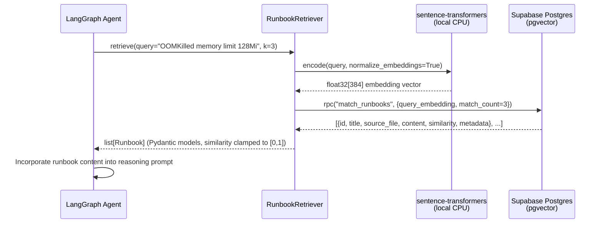

# RAG Architecture

KubeSentinel's retrieval-augmented generation (RAG) layer gives the LangGraph agent access to historical SRE knowledge. When a new incident alert arrives, the agent queries the runbook store and retrieves the most relevant past runbooks before reasoning about a diagnosis or fix.

## Schema Design

The runbooks are stored in a Supabase Postgres table backed by the `pgvector` extension.

```sql
CREATE TABLE runbooks (
    id           UUID        PRIMARY KEY DEFAULT gen_random_uuid(),
    title        TEXT        NOT NULL,
    source_file  TEXT        NOT NULL,       -- e.g. "oomkilled-pod.md"
    chunk_index  INTEGER     NOT NULL,       -- 0-indexed within the file
    content      TEXT        NOT NULL,       -- the chunk text
    embedding    VECTOR(384) NOT NULL,       -- BAAI/bge-small-en-v1.5 output
    metadata     JSONB       NOT NULL,       -- section heading, hash, frontmatter
    created_at   TIMESTAMPTZ NOT NULL DEFAULT NOW(),
    UNIQUE (source_file, chunk_index)
);
```

**Index:** HNSW with `vector_cosine_ops` (`m=16`, `ef_construction=128`). HNSW was chosen over IVFFlat because it delivers better recall at low query latency on a small corpus (< 10k rows) with no training step required.

**Match function:** `match_runbooks(query_embedding vector, match_count int)` returns `(id, title, source_file, content, similarity, metadata)` sorted by cosine similarity descending.

## Embedding Model Rationale

| Model | Dimensions | Size | Licence | API cost |
|-------|-----------|------|---------|----------|
| `BAAI/bge-small-en-v1.5` | 384 | ~130MB | MIT | None (local) |
| `text-embedding-3-small` | 1536 | — | Proprietary | $0.02/1M tokens |
| `all-MiniLM-L6-v2` | 384 | ~90MB | Apache-2.0 | None (local) |

`BAAI/bge-small-en-v1.5` was selected because:
- **Quality**: top-tier retrieval performance on the BEIR benchmark for its size class.
- **Cost**: runs on CPU with no external API calls — zero per-query cost and no network dependency during incident response.
- **Portability**: MIT licence, no usage restrictions.
- **Dimensions**: 384 dimensions keep the HNSW index small and queries fast.

Embeddings are `normalize_embeddings=True` so that cosine similarity equals the dot product, matching the `vector_cosine_ops` index operator.

## Chunking Strategy

Raw runbooks are ~400–600 words. Chunking splits them into retrieval-sized units:

1. **`MarkdownHeaderTextSplitter`** splits on `## ` headings. Each runbook section (Symptoms, Root Cause, Investigation Steps, etc.) becomes a separate document, preserving semantic coherence.
2. **`RecursiveCharacterTextSplitter`** (`chunk_size=1000`, `chunk_overlap=100`) further splits any section that exceeds 1000 characters, with 100-character overlap to avoid cutting a sentence mid-thought.

Section metadata (`section` heading) is propagated to each chunk's `metadata` column, allowing the agent to see which part of a runbook matched.

## Retrieval Flow



## Idempotent Ingestion

The ingestion script (`agent/rag/ingest.py`) is safe to re-run. Each chunk carries a SHA-256 hash of `(source_file, chunk_index, content)` in its `metadata.hash` field. On re-ingestion, the script fetches existing hashes from Supabase and skips any chunk whose hash matches — only new or changed chunks are upserted.

```
py -3.12 -m agent.rag.ingest          # ingest all runbooks
py -3.12 -m agent.rag.ingest --dry-run  # preview chunks without writing
```

## Module Map

```
agent/rag/
  settings.py        ← pydantic-settings: SUPABASE_URL, SUPABASE_SERVICE_ROLE_KEY, DATABASE_URL
  migrations/
    001_create_runbooks.sql  ← idempotent DDL (table, HNSW index, match function)
  migrate.py         ← runs DDL via psycopg2 + DATABASE_URL
  ingest.py          ← chunk → embed → upsert pipeline
  retriever.py       ← RunbookRetriever, Runbook model, get_retriever()
  cli.py             ← py -3.12 -m agent.rag.cli query "..."
```
